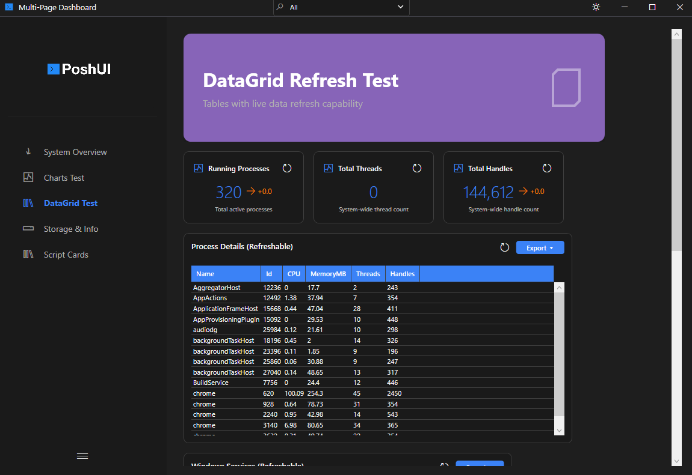

# Visualization Cards

Visualization cards are the primary components of PoshUI dashboards. They provide specialized displays for different types of data.



## Adding Cards

Each card type has its own cmdlet, and each takes the step to add it to, a unique name and a title:

```powershell
Add-UIMetricCard -Step 'Overview' -Name 'Cpu'     -Title 'CPU'       -Value 42 -Unit '%'
Add-UIChartCard  -Step 'Overview' -Name 'Trend'   -Title 'Sales'     -ChartType 'Line' -Data $series
Add-UITableCard  -Step 'Overview' -Name 'Procs'   -Title 'Processes' -Data (Get-Process | Select-Object -First 10 Name, Id)
Add-UIStatusCard -Step 'Overview' -Name 'Health'  -Title 'Services'
Add-UIScriptCard -Step 'Overview' -Name 'Cleanup' -Title 'Clear temp' -ScriptBlock { Remove-Item "$env:TEMP\*" -Recurse -Force }
```

## Supported Card Types

### MetricCard
Designed for Key Performance Indicators (KPIs). It shows a large value, an optional unit, a trend indicator, and an icon.

- **Use case**: CPU usage, memory availability, active user count.
- **Key Parameters**: `-Value`, `-Unit`, `-Trend`, `-TrendValue`, `-Icon`, `-IconPath`, `-Target`.

```powershell
Add-UIMetricCard -Step 'Overview' -Name 'CPU' -Title 'CPU Usage' `
    -Value 75 -Unit '%' -Target 100 `
    -IconPath 'C:\Icons\cpu_3d.png'   # Full-color PNG icon (v1.3.0)
```

### GraphCard
Displays data in various chart formats.

- **Use case**: Historical performance, distribution of resources.
- **Chart Types**: `Bar`, `Line`, `Area`, `Pie`.
- **Key Parameters**: `-ChartType`, `-Data`.

### DataGridCard
Displays tabular data in a sortable, filterable grid.

- **Use case**: Process lists, event logs, service status tables.
- **Key Parameters**: `-Data`, `-AllowSort`, `-AllowExport`.

### InfoCard
A display-only card for providing context or instructions.

- **Use case**: Dashboard descriptions, help information.
- **Key Parameters**: `-Title`, `-Description`, `-Content`, `-IconPath`.

```powershell
Add-UICard -Step 'Details' -Name 'ServerInfo' -Title 'Server Info' `
    -Content 'Hostname: SERVER-01' `
    -IconPath 'C:\Icons\server_3d.png'   # Full-color PNG icon (v1.3.0)
```

## Card Customization

All cards support the following common parameters:

| Parameter | Description |
|-----------|-------------|
| `-Title` | The bold header text at the top of the card. |
| `-Description` | Smaller text shown below the title. |
| `-Icon` | Segoe MDL2 icon glyph (monochrome). |
| `-IconPath` | Path to a PNG/ICO image file for full-color icons. *(v1.3.0)* |
| `-Category` | String used for grouping and filtering cards. |

::: tip
When both `-Icon` and `-IconPath` are specified, the PNG image takes priority. If the file cannot be loaded, the glyph icon is shown as a fallback.
:::

## Live Refresh

Cards can be configured to update automatically without reloading the entire dashboard.

```powershell
Add-UIMetricCard -Step 'Main' -Name 'CPU' `
    -Title 'Live CPU' `
    -RefreshScript { (Get-CimInstance Win32_Processor | Measure-Object LoadPercentage -Average).Average }
```

::: tip
See [Live Refresh](./refresh.md) for more details on scheduling updates.
:::

Next: [Script Cards](../visualization/script-cards.md)
