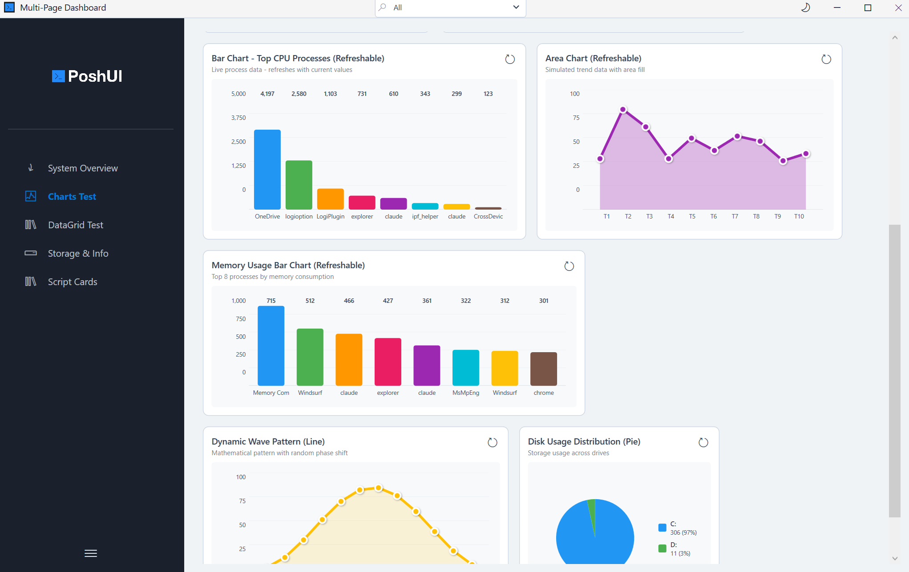

# Get Started

Get up and running with PoshUI in minutes.



## System Requirements

- Windows 10/11 or Windows Server 2016+ (x64)
- .NET Framework 4.8 (pre-installed on Windows 10+)
- Windows PowerShell 5.1 (included with Windows)

## Install PoshUI

Download the latest release or build from source.

::: code-group

```powershell [Download Release]
# Download from GitHub Releases
# https://github.com/Kanders-II/PoshUI/releases

# Extract and unblock
Get-ChildItem -Recurse | Unblock-File
```

```powershell [Build from Source]
# Clone the repository
git clone https://github.com/Kanders-II/PoshUI.git
cd PoshUI

# Build the solution
dotnet build Launcherauncher.csproj -c release   # -> poshuiinposhui.exe
```

:::

## Create Your First Canvas App *(new in v1.4.0)*

Canvas is the free-form module: no fixed shell, and the script *is* the application. Start here if you want to
lay things out yourself rather than fit an opinionated frame.

```powershell
# Import the Canvas module
Import-Module .\PoshUI\PoshUI.Canvas\PoshUI.Canvas.psd1 -Force

New-PoshUICanvas -Title 'My First Canvas App' -Theme Dark -Width 640 -Height 420
Add-UICanvasPage -Title 'Home' -Layout VStack

Add-UICanvasLabel 'What is your name?' -FontSize 18 -FontWeight Bold
Add-UICanvasTextBox -Name who -Value 'World'
Add-UICanvasButton 'Greet' -Style Accent -Action {
    Show-UICanvasToast -Message ("Hello, " + (Get-UICanvasValue -Name who)) -Severity success
}

Show-PoshUICanvas
```

::: tip Save as UTF-8 **with BOM**
If your script contains any non-ASCII character (—, ●, emoji, accents), save it as UTF-8 **with** a BOM.
Windows PowerShell 5.1 misreads UTF-8 without one and the app breaks.
:::

More: [About Canvas](./canvas/about.md) · [Capability Reference](./Canvas-Reference.md) ·
runnable demos in `PoshUI\Examples\Canvas-*.ps1`

## Create Your First Wizard

```powershell
# Import the Wizard module
$modulePath = Join-Path $PSScriptRoot 'PoshUI\PoshUI.Wizard\PoshUI.Wizard.psd1'
Import-Module $modulePath -Force

# Initialize wizard
New-PoshUIWizard -Title 'My First Wizard' -Theme 'Auto'

# Add a step
Add-UIStep -Name 'Welcome' -Title 'Welcome' -Order 1

# Add a control
Add-UITextBox -Step 'Welcome' -Name 'UserName' -Label 'Your Name' -Mandatory

# Show the wizard
$result = Show-PoshUIWizard

# Process results
if ($result) {
    Write-Host "Hello, $($result.UserName)!"
}
```

## Create Your First Dashboard

```powershell
# Import the Dashboard module
$modulePath = Join-Path $PSScriptRoot 'PoshUI\PoshUI.Dashboard\PoshUI.Dashboard.psd1'
Import-Module $modulePath -Force

# Initialize dashboard
New-PoshUIDashboard -Title 'System Dashboard' -Theme 'Auto'

# Add dashboard step
Add-UIStep -Name 'Dashboard' -Title 'Monitor' -Order 1

# Add a metric card (using new type-specific cmdlet)
Add-UIMetricCard -Step 'Dashboard' -Name 'CPU' -Title 'CPU Usage' `
    -Value { (Get-CimInstance Win32_Processor | Measure-Object LoadPercentage -Average).Average } `
    -Unit '%' -Icon '&#xE7C4;'

# Show the dashboard
Show-PoshUIDashboard
```

## Create Your First Workflow

```powershell
# Import the Workflow module
$modulePath = Join-Path $PSScriptRoot 'PoshUI\PoshUI.Workflow\PoshUI.Workflow.psd1'
Import-Module $modulePath -Force

# Initialize workflow
New-PoshUIWorkflow -Title 'System Configuration'

# Add configuration step (wizard)
Add-UIStep -Name 'Config' -Title 'Configuration' -Order 1
Add-UITextBox -Step 'Config' -Name 'ServerName' -Label 'Server Name' -Mandatory

# Add execution step (workflow tasks)
Add-UIStep -Name 'Execution' -Title 'Execution' -Order 2 -Type Workflow

# Add a task
Add-UIWorkflowTask -Step 'Execution' -Name 'Configure' -Title 'Configuring Server' `
    -ScriptBlock {
        $PoshUIWorkflow.WriteOutput("Configuring $ServerName...", "INFO")
        Start-Sleep -Seconds 2
        $PoshUIWorkflow.WriteOutput("Configuration complete", "INFO")
    }

# Show the workflow
Show-PoshUIWorkflow
```

## Next Steps

Learn more about the various features of PoshUI:

### Wizards & Workflows
- [Wizards](./wizards/about.md) - Step-by-step guided interfaces
- [Workflows](./workflows/about.md) - Multi-task automation with progress tracking
  - [Creating Workflows](./workflows/creating-workflows.md) - Basic structure
  - [Progress Reporting Guide](./workflows/progress-reporting.md) - WriteOutput() vs UpdateProgress()
  - [Data Passing Patterns](./workflows/data-passing.md) - Wizard inputs, task arguments, context
  - [Reboot & Resume](./workflows/reboot-resume.md) - Multi-phase workflows with reboots

### Dashboards & Monitoring
- [Dashboards](./dashboards/about.md) - Card-based monitoring
- [Visualization Cards](./visualization/metric-cards.md) - Charts, metrics, and data grids

### General
- [Controls](./controls/about.md) - Input and display components
- [Examples](./examples/demo-all-controls.md) - Working demonstrations
