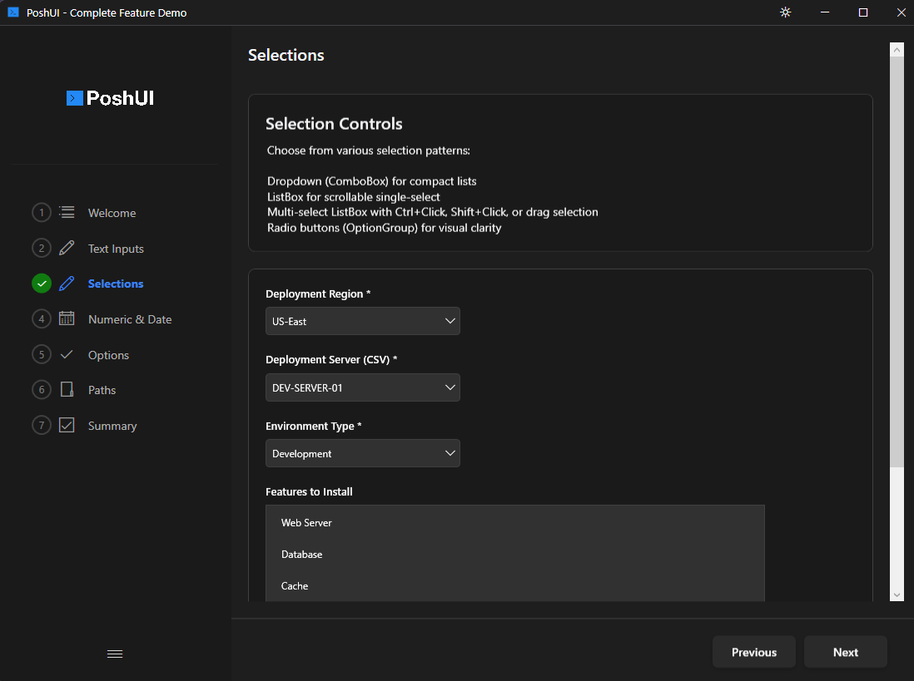

# About

Build beautiful PowerShell wizards, dashboards, workflows, and free-form apps—the PowerShell way.


PoshUI enables IT professionals to create professional Windows 11-style interfaces using familiar PowerShell cmdlets—**no WPF, XAML, or C# knowledge required**.

## Four Independent Modules

PoshUI consists of four independent modules that can be used separately:

### PoshUI.Canvas *(new in v1.4.0)*

**Free-form apps** — lay out anything, anywhere, with no fixed shell. Where the other three modules give you an
opinionated frame, Canvas gives you a blank page and ~85 cmdlets. A single `.ps1` **is** the application: no
XAML, no MVVM, no project scaffolding, no build step.

```powershell
Import-Module PoshUI.Canvas
New-PoshUICanvas -Title 'Hello' -Theme Dark
Add-UICanvasPage -Title 'Home' -Layout VStack
Add-UICanvasTextBox -Name who -Value 'World'
Add-UICanvasButton 'Greet' -Style Accent -Action {
    Show-UICanvasToast -Message ("Hello, " + (Get-UICanvasValue -Name who))
}
Show-PoshUICanvas
```

- [About Canvas](./canvas/about.md) - what it is, how it works, and how to use it
- [Capability Reference](./Canvas-Reference.md) - every control and runtime cmdlet
- [Agent Authoring Guide](./agent/README.md) - context pack for building Canvas apps with an AI assistant
- Engine-native workflow runner with retry, timeouts, skip conditions and reboot-resume
- Tabs, menus, splitters, cascading fields, master/detail grids, charts and reactive state
- Two real-world example apps ship in `Examples/` — scheduled-task orchestration and end-user self-service

### PoshUI.Wizard

Create step-by-step guided interfaces for configuration, deployment, and setup workflows. Perfect for server provisioning, VM creation, and application deployment.



Full-color PNG emoji icons on every UI element *(v1.3.0)*:


- [Step-by-Step Navigation](./wizards/steps.md)
- [12+ Built-in Controls](./controls/about.md)
- [Live Execution Console](./wizards/execution.md)
- [Branding & Customization](./wizards/branding.md)
- [Dynamic Data Sources](./controls/dynamic-controls.md)
- [Input Validation & Error Handling](./platform/validation.md)
- [PNG Icon Support](./configuration/icons.md) *(v1.3.0)*
- [Dual-Mode Custom Themes](./platform/custom-themes.md) *(v1.3.0)*

### PoshUI.Dashboard

Build card-based monitoring interfaces with metrics, charts, and interactive tools. Perfect for system monitoring, KPI displays, IT operations centers, and sharing tools with your team.


- [MetricCards](./visualization/metric-cards.md) - Display KPIs and system metrics
- [GraphCards (Bar, Line, Area, Pie)](./visualization/graph-cards.md) - Visualize trends and data
- [DataGridCards](./visualization/datagrid-cards.md) - Show tabular data
- [ScriptCards](./visualization/script-cards.md) - Turn scripts into clickable tools for end users
- [Carousel Banners with PNG Icons](./carousel-clickable-links.md) - Clickable carousel slides with per-slide PNG icons *(v1.3.0)*
- [Category Filtering](./dashboards/categories.md) - Organize cards into filterable groups
- [Real-time Data Updates](./dashboards/refresh.md) - Auto-refresh cards with live PowerShell execution
- [PNG Icon Support](./configuration/icons.md) - Full-color icons on steps, cards, and banners *(v1.3.0)*
- [Dual-Mode Custom Themes](./platform/custom-themes.md) *(v1.3.0)*

**ScriptCards** with PNG icons empower end users to run PowerShell scripts with a single click:


### PoshUI.Workflow

Orchestrate multi-step automated processes with progress tracking, approval gates, and reboot/resume capabilities. Perfect for server deployments, software installations, and maintenance tasks.


- [Task-Based Execution](./workflows/tasks.md)
- [Progress Tracking](./workflows/progress-reporting.md)
- [Approval Gates](./workflows/about.md)
- [Reboot & Resume](./workflows/reboot-resume.md)
- [Data Passing Between Tasks](./workflows/data-passing.md)
- [Workflow Logging](./workflows/logging.md)

## Platform

Built on .NET Framework 4.8 with a hybrid architecture combining PowerShell flexibility with WPF rendering power.

- [Windows PowerShell 5.1 Support](./system-requirements.md)
- [Windows 10/11 & Server 2016+](./system-requirements.md)
- [Light/Dark Theme Support](./platform/theming.md) with runtime toggle *(v1.3.0)*
- [Dual-Mode Custom Themes](./platform/custom-themes.md) *(v1.3.0)*
- [PNG Icon Support](./configuration/icons.md) across all modules *(v1.3.0)*
- [CMTrace-Compatible Logging](./platform/logging.md)
- [No External Dependencies](./installation.md)

## Community

Join the PoshUI community and contribute to the project.

- [GitHub Repository](https://github.com/Kanders-II/PoshUI)
- [Issue Tracker](https://github.com/Kanders-II/PoshUI/issues)
- [Discussions](https://github.com/Kanders-II/PoshUI/discussions)

## Licensing

PoshUI is open source under the MIT License.

[View License](./licensing.md)
