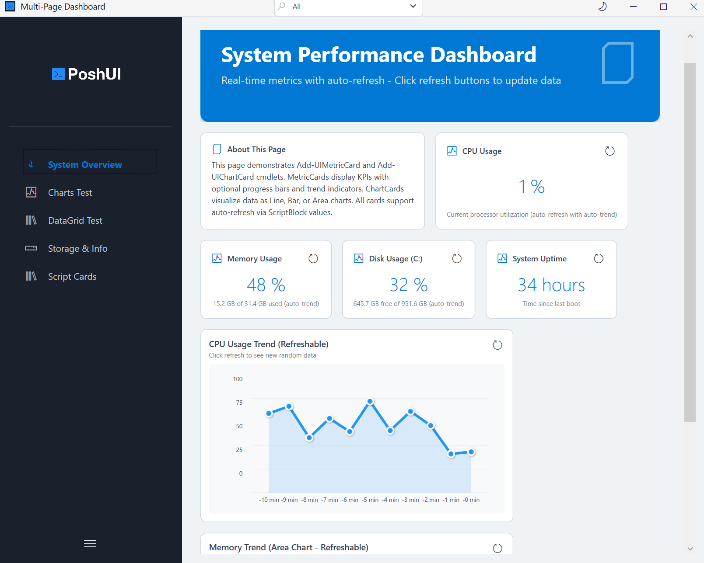

# GraphCard

::: warning Dashboard Module Only
GraphCards are only available in the **PoshUI.Dashboard** module. They cannot be used in Wizards or Workflows.
:::

The `GraphCard` provides interactive charts for visualizing trends and distributions directly on your dashboard.



## Basic Usage

```powershell
$chartData = @(
    @{ Label = 'Jan'; Value = 100 }
    @{ Label = 'Feb'; Value = 150 }
    @{ Label = 'Mar'; Value = 120 }
)

Add-UIChartCard -Step 'Overview' -Name 'SalesChart' `
    -Title 'Monthly Sales' -ChartType 'Bar' -Data $chartData
```

## Supported Chart Types

`-ChartType` accepts five values:

- **Bar**: Best for comparing distinct categories.
- **Line**: Ideal for showing trends over time.
- **Area**: Similar to line charts but highlights the volume under the line.
- **Pie**: Best for showing proportional distributions (percentage of a whole).
- **Donut**: A pie with the centre cut out - the same data, more room for a legend.

## Data Format

The `-Data` parameter accepts an array of hashtables. Each hashtable should contain a `Label` (string) and a `Value` (numeric).

```powershell
$data = @(
    @{ Label = 'Available'; Value = 45 }
    @{ Label = 'Used'; Value = 55 }
)
Add-UIChartCard -Step 'Overview' -Name 'Storage' `
    -Title 'Storage Distribution' -ChartType 'Pie' -Data $data
```

## Key Parameters

| Parameter | Type | Description |
|-----------|------|-------------|
| `-ChartType`| String | `'Line'`, `'Bar'`, `'Area'`, `'Pie'` or `'Donut'`. |
| `-Data` | Array | An array of hashtables containing `Label` and `Value`. |
| `-ShowLegend`| Boolean| Whether to display the chart legend (default: `$true`). |
| `-ShowTooltip`| Boolean| Whether to show values when hovering over data points (default: `$true`). |

## Live Refresh

A chart with a `-RefreshScript` can be re-run from the card itself, or by the dashboard's Refresh all - see [Card Refresh](../dashboards/refresh.md).

```powershell
Add-UIChartCard -Step 'Overview' -Name 'LiveNet' `
    -Title 'Network Traffic' -ChartType 'Area' -Data @() `
    -RefreshScript {
        # Fetch latest traffic stats and return as chart data
        Get-NetworkStats | Select-Object @{N='Label';E={$_.Time}}, @{N='Value';E={$_.Bytes}}
    }
```

Next: [DataGridCard](./datagrid-cards.md)
