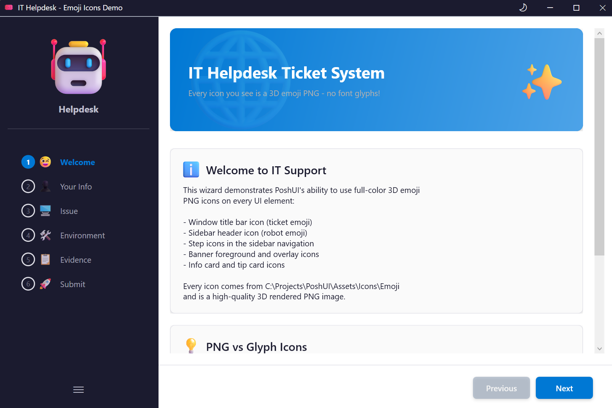
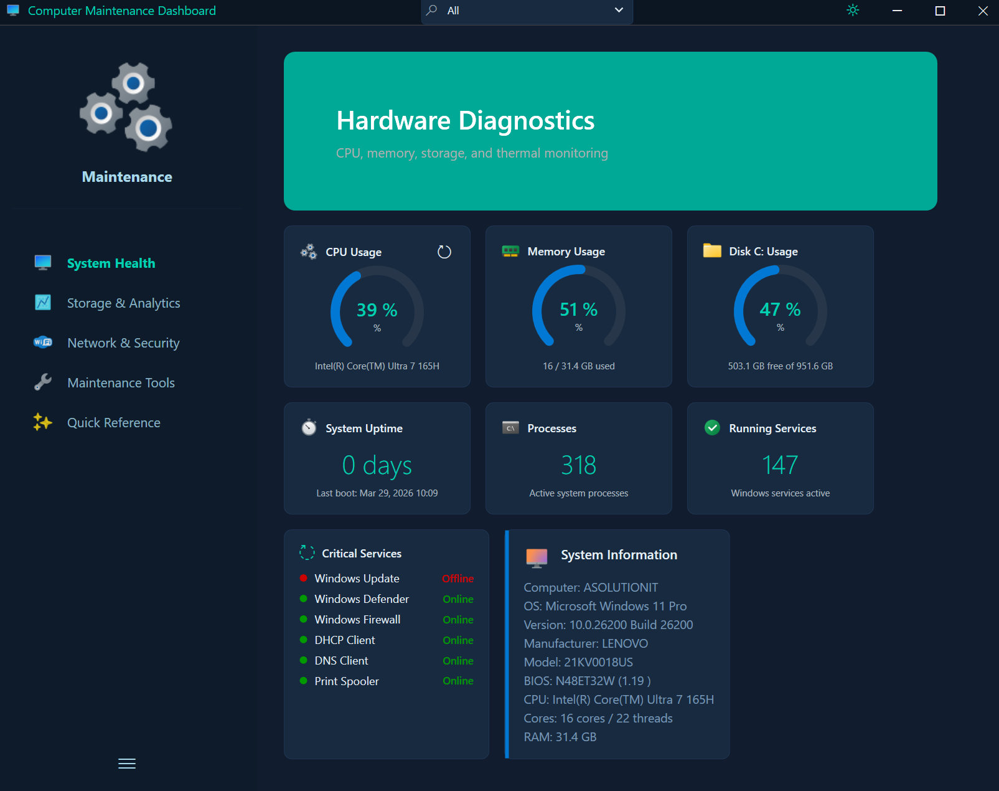
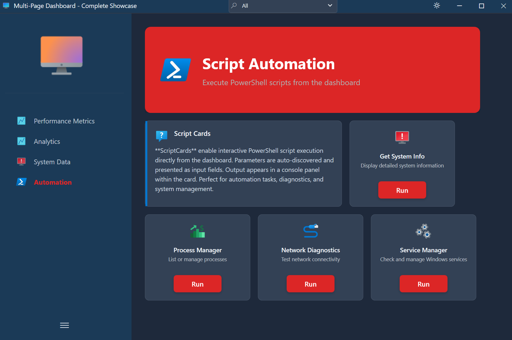

<div align="center">

<picture>
  <source media="(prefers-color-scheme: dark)" srcset="Images/Color%20logo%20-%20no%20background.png">
  <source media="(prefers-color-scheme: light)" srcset="Images/Color%20logo%20with%20background.png">
  
</picture>


[](https://github.com/Kanders-II/PoshUI/releases)
[](LICENSE)
[](https://dotnet.microsoft.com/download/dotnet-framework/net48)
[](https://docs.microsoft.com/en-us/powershell/)

</div>

---

## Welcome to PoshUI

PoshUI is a PowerShell UI framework that brings professional interfaces to your automation scripts. Create step-by-step wizards, live monitoring dashboards, and automated workflows—all with PowerShell cmdlets you already know.

This is my contribution to the PowerShell community, combining the flexibility of PowerShell with the polish of WPF to create something that IT professionals can actually use in their daily work. Built with object-oriented programming principles, it focuses on maintainable, modular code while keeping the end-user experience simple and intuitive.

**What PoshUI Does:**  
Turn your PowerShell automation into professional Windows 11-style wizards, dashboards, and workflows—using familiar PowerShell cmdlets. No WPF, XAML, or C# knowledge required.

**Who It's For:**  
IT professionals, system administrators, and DevOps engineers who want to make their automation accessible to help desk teams, colleagues, and end users who prefer a GUI over a command line.

---

## Three PowerShell Modules

PoshUI provides three independent modules, each designed for a specific use case:

### PoshUI.Wizard
**Step-by-step guided interfaces** for configuration, deployment, and setup tasks.  
Perfect for collecting user input with validation, then executing your automation logic.

**Full-color PNG emoji icons** in sidebar navigation, banners, and cards *(v1.3.0)*:



### PoshUI.Dashboard
**Real-time monitoring interfaces** with metrics, charts, and interactive tools.  
Build card-based dashboards that display KPIs, visualize data, and turn scripts into clickable tools.



**ScriptCards** turn PowerShell scripts into clickable tools for end users — with PNG icons:



### PoshUI.Workflow
**Multi-step automation** with progress tracking and reboot/resume capabilities.  
Orchestrate complex processes like server deployments, software installations, and maintenance tasks.


---

## Quick Start

### Installation

**Requirements:**
- Windows 10/11 or Windows Server 2016+ (x64)
- .NET Framework 4.8 (pre-installed on Windows 10+)
- Windows PowerShell 5.1 (included with Windows)

**Download:**
1. Download the latest release from [GitHub Releases](https://github.com/Kanders-II/PoshUI/releases)
2. Extract and unblock files: `Get-ChildItem -Recurse | Unblock-File`

### Simple Example

```powershell
# Import the Wizard module
Import-Module .\PoshUI\PoshUI.Wizard\PoshUI.Wizard.psd1

# Create a wizard
New-PoshUIWizard -Title 'Server Setup' -Theme 'Auto'

# Add a step
Add-UIStep -Name 'Config' -Title 'Configuration' -Order 1

# Add controls
Add-UITextBox -Step 'Config' -Name 'ServerName' -Label 'Server Name' -Mandatory
Add-UIDropdown -Step 'Config' -Name 'Environment' -Label 'Environment' `
    -Choices @('Dev', 'Test', 'Prod') -Mandatory

# Execute with optional script body
Show-PoshUIWizard -ScriptBody {
    Write-Host "Configuring $ServerName in $Environment..." -ForegroundColor Cyan
    # Your automation logic here
}
```

---

## Key Features

- **12+ Input Controls** - TextBox, Dropdown, Password, Date, File/Folder pickers, and more
- **Dashboard Visualization** - MetricCards, Charts (Bar/Line/Area/Pie), DataGrids, ScriptCards
- **Dynamic Controls** - Cascading dropdowns with scriptblock data sources
- **Workflow Automation** - Multi-task execution with progress tracking and reboot/resume
- **Light/Dark Themes** - Auto-detect system theme or force Light/Dark mode
- **Theme Toggle** - Sun/moon button in title bar to switch themes at runtime *(v1.3.0)*
- **Dual-Mode Custom Themes** - Define independent color palettes for light and dark modes *(v1.3.0)*
- **PNG Icon Support** - Full-color PNG/ICO icons on steps, cards, banners, and branding *(v1.3.0)*
- **Live Execution Console** - Real-time output display during script execution
- **CMTrace Logging** - Enterprise-ready audit trails
- **Zero Dependencies** - No third-party libraries or NuGet packages

---

## Documentation

**Full documentation:** [https://kanders-ii.github.io/PoshUI](https://kanders-ii.github.io/PoshUI)

The complete documentation includes:
- **Cmdlet Reference** - All PowerShell cmdlets with examples
- **Module Guides** - Wizards, Dashboards, and Workflows
- **Control Library** - 12+ input and visualization controls
- **Examples** - Real-world use cases and patterns

---

## Contributing

PoshUI is my contribution to the PowerShell community. Contributions, feedback, and suggestions from others are welcome!

**How to contribute:**
- Report bugs or request features via [GitHub Issues](https://github.com/Kanders-II/PoshUI/issues)
- Submit pull requests for improvements
- Share your use cases and examples

---

## Icon Attributions

### Icons8

Some example scripts in this project use icons provided by [Icons8](https://icons8.com). Icons8 icons are used under their [licensing terms](https://icons8.com/license). If you use these icons in your own projects, please provide appropriate attribution to Icons8.

### Microsoft Fluent Emoji

Some example scripts use 3D emoji icons from the [Microsoft Fluent Emoji](https://github.com/microsoft/fluentui-emoji) repository. Fluent Emoji is published by Microsoft under the [MIT License](https://github.com/microsoft/fluentui-emoji/blob/main/LICENSE). These high-quality 3D rendered PNG icons are ideal for use with PoshUI's `-IconPath` parameter.

---

## License

MIT License - See [LICENSE](LICENSE) file for details.

**Maintained by [Kanders-II](https://github.com/Kanders-II)**
